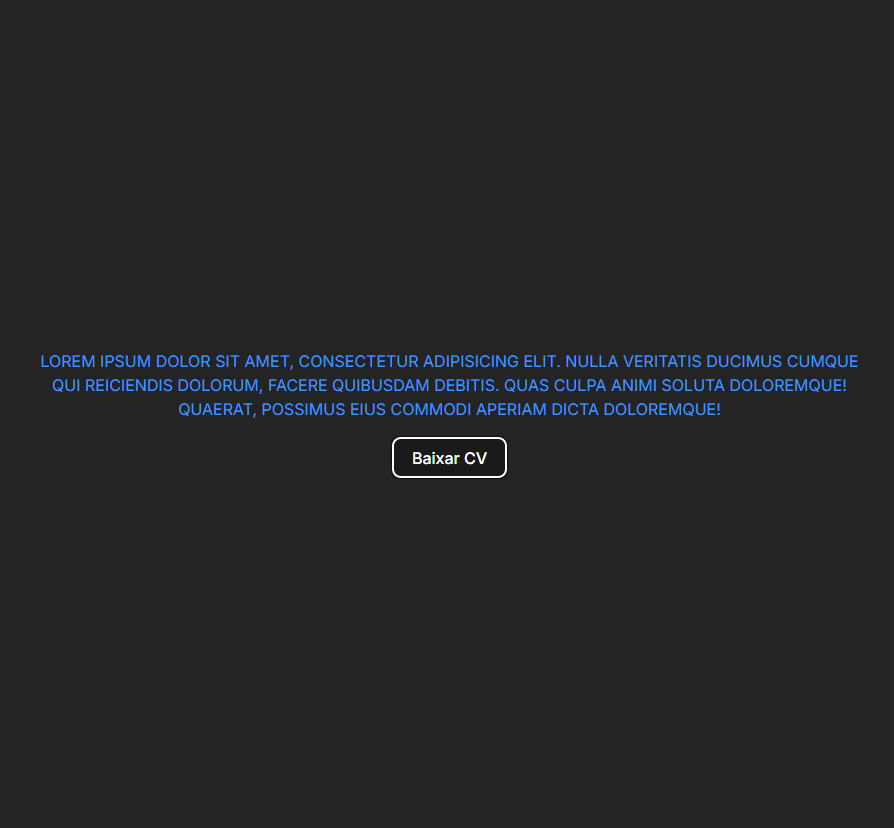

# | 🧙‍♂️ Quest 🏹🐲 | React Base

## Sobre o Desafio 🔭

Desafio 2 - Criar um componente que colore e transforma um texto para
maiúsculo (uppercase) utilizando JS.

O nome do componente e o nome das props devem ser bem pensados, lembre-se de dar bons nomes que sejam fáceis de outras pessoas entenderem.
1. Dê um bom nome ao seu componente;
2. Faça o componente renderizar na tela um parágrafo colorido e com todas as letras maiúsculas usando JS;
3. Utilize props para passar o texto e a cor de texto desejada para dentro do componente (a cor pode ser uma palavra, como 'red', ou um hexadecimal);
4. Pode utilizar o style inline para colorir o componente da forma que foi mostrado nas aulas;

Se ficar com dúvidas revise as aulas.

Desafio 2 - Mostrar mensagem com a label do botão

Crie um componente Button com um evento de clique que apresente um alerta informando a prop label do botão que foi clicado, com a seguinte mensagem: "A label desse botão é **insira a label aqui via JS**.
Exemplo: Com um botão com essa label, **Button label="Baixar CV"** Ao clicar no botão deve mostrar um alert com a mensagem "A label desse botão é Baixar CV"

## Screenshots 🎴

### Desktop



## Solução 📝

### Desafio 1

```JSX
const Paragraph = ({color}) => {
    return (
        <p className='paragraph' style={{ color: color, textTransform: 'uppercase' }}>Lorem ipsum dolor sit amet, consectetur adipisicing elit. Nulla veritatis ducimus cumque qui reiciendis dolorum, facere quibusdam debitis. Quas culpa animi soluta doloremque! Quaerat, possimus eius commodi aperiam dicta doloremque!</p>
    )
}

Paragraph.defaultProps = {
    color: '#4097FC'
}

export default Paragraph
```

### Desafio 2

```JSX
const showBtnLabel = (label) => {
    alert(`A label desse botão é ${label}`)
}

const Button = ({label}) => {
    return (
        <button label={label} onClick={() => showBtnLabel(label)}>{label}</button>
    )
}

Button.defaultProps = {
    label: 'Baixar CV'
}

export default Button
```

## Autor 🧙‍♂️

- GitHub: [Ramon Alvez](https://github.com/Ramon-Alvez)
- LinkedIn: [@Ramon Alvez](www.linkedin.com/in/ramon-alvez)